<p align="center">
  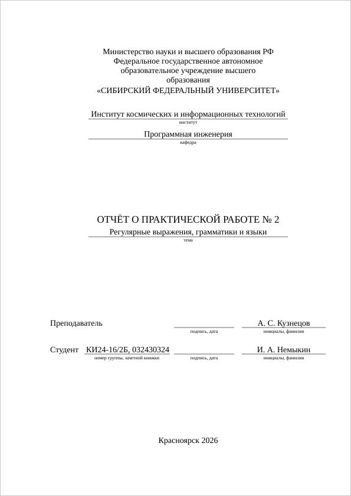
</p>

---

## Цель работы

Реализация и исследование регулярных выражений, регулярных грамматик и свойств регулярных языков, а также доказательство нерегулярности языков.

## Постановка задачи

**Часть 1.** С использованием JFLAP построить регулярное выражение (РВ) для языка `L2 = {aⁿbᵐ : n ≥ 4, m ≤ 3}` или формально доказать невозможность этого. Привести обобщённый граф переходов, эквивалентный конечный автомат (КА) и пошаговое выполнение преобразований.

**Часть 2.** С использованием JFLAP построить регулярную грамматику (РГ) для того же языка или формально доказать невозможность этого. Привести эквивалентный КА и РВ, а также пошаговое выполнение преобразований.

**Часть 3.** С помощью леммы о разрастании доказать, что язык `L28 = {aⁿbˡaᵏ : k ≠ n + l}` не является регулярным.

Файлы работы:

- [Variant2_RE.jff](Variant2_RE.jff) - регулярное выражение (часть 1);
- [Variant2_Grammar.jff](Variant2_Grammar.jff) - регулярная грамматика (часть 2).

## 1. Анализ языка

`L2 = {aⁿbᵐ : n ≥ 4, m ≤ 3}` - цепочки из не менее чем четырёх символов `a`, за которыми идёт от нуля до трёх символов `b`.

Язык регулярен: распознающему автомату достаточно помнить, сколько прочитано символов `a` (0, 1, 2, 3 или «4 и больше») и сколько символов `b` (от 0 до 3). Это конечное число вариантов, поэтому РВ и РГ для `L2` существуют, и доказательство невозможности их построения не требуется.

Примеры: `aaaa`, `aaaaab`, `aaaabbb` принадлежат языку; `aaab` (меньше четырёх `a`), `aaaabbbb` (больше трёх `b`), `aaaaba` (`a` после `b`), `bbb` (нет `a`) и пустая цепочка ε не принадлежат.

## 2. Часть 1. Регулярное выражение

### 2.1. Полученное РВ

```
aaaaa*(!+b+bb+bbb)
```

В JFLAP `+` - объединение, `*` - замыкание Клини, `!` - пустая цепочка (на графах JFLAP показывает её как λ). Подвыражение `aaaaa*` - это четыре обязательных `a` и любое число дополнительных (`aaaa·a*`), подвыражение `(!+b+bb+bbb)` - от нуля до трёх `b`. В математической записи: `aaaa·a*·(ε + b + bb + bbb)`.

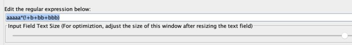

*Рисунок 1 - Регулярное выражение в редакторе JFLAP (файл [Variant2_RE.jff](Variant2_RE.jff))*

### 2.2. Пошаговое преобразование РВ в КА (Convert → Convert to NFA)

JFLAP начинает с обобщённого графа переходов из двух состояний, дуга между которыми помечена всем выражением. Каждое нажатие **Do Step** раскрывает одну операцию на одной дуге: конкатенацию, замыкание, скобки или объединение. Для раскрытой операции JFLAP добавляет новые состояния и λ-переходы. Преобразование заканчивается, когда все дуги помечены одним символом или λ.

Новые состояния JFLAP ставит поверх уже существующих. Поэтому после каждого шага я перетаскивал их на свободные места: часть `aaaaa*` идёт по верхней строке слева направо, а ветви объединения - по нижним строкам справа налево. На автомат перестановка не влияет, меняется только картинка.

**Исходный граф.** Одна дуга `q0 → q1` с меткой `aaaaa*(λ+b+bb+bbb)`. Сообщение JFLAP: «1 more resolutions needed».

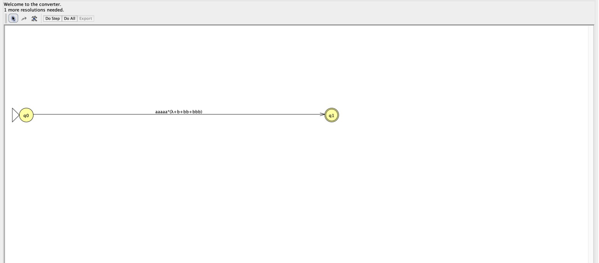

*Рисунок 2 - Исходный обобщённый граф переходов*

**Шаг 1. Конкатенация.** Выражение разбито на шесть сомножителей: `a`, `a`, `a`, `a`, `a*`, `(λ+b+bb+bbb)`. Каждому выделена своя дуга (`q2→q3`, `q4→q5`, `q6→q7`, `q8→q9`, `q10→q11`, `q12→q13`), а соседние дуги связаны λ-переходами. Осталось раскрыть `a*` и `(λ+b+bb+bbb)`.

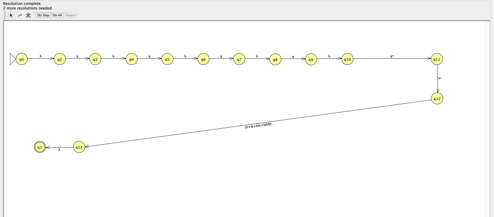

*Рисунок 3 - После шага 1: раскрыта конкатенация*

**Шаг 2. Замыкание `a*`.** Дуга `q10 → q11` заменена конструкцией для звёздочки: `q10 -λ-> q14 -a-> q15 -λ-> q11`, переход `q10 -λ-> q11` (ноль повторений) и обратный `q11 -λ-> q10` (повторение).

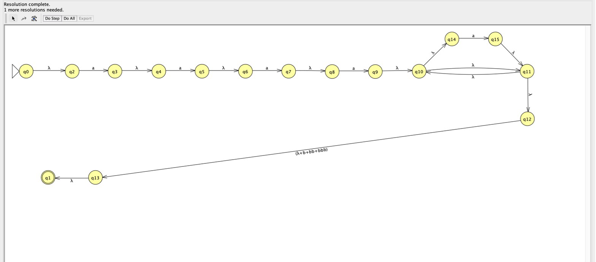

*Рисунок 4 - После шага 2: раскрыто замыкание `a*`*

**Шаг 3. Скобки.** С дуги `q12 → q13` сняты внешние скобки, метка стала `λ+b+bb+bbb`.

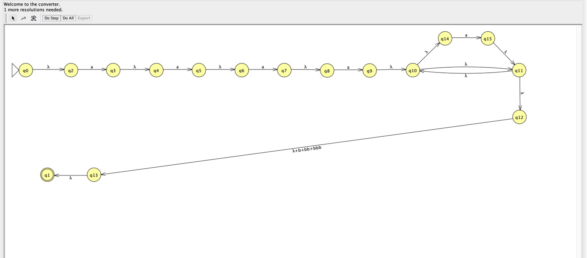

*Рисунок 5 - После шага 3: сняты скобки*

**Шаг 4. Объединение.** Дуга `q12 → q13` заменена четырьмя параллельными ветвями: `q16 -λ-> q17`, `q18 -b-> q19`, `q20 -bb-> q21` и `q22 -bbb-> q23`. Из `q12` в начало каждой ветви ведёт λ-переход, из конца ветви в `q13` - тоже λ-переход. Осталось раскрыть `bb` и `bbb`.

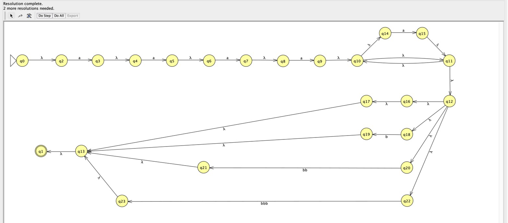

*Рисунок 6 - После шага 4: раскрыто объединение*

**Шаг 5. Конкатенация `bb`.** Дуга `q20 → q21` разбита на два перехода по `b`: `q20 -λ-> q24 -b-> q25 -λ-> q26 -b-> q27 -λ-> q21`.

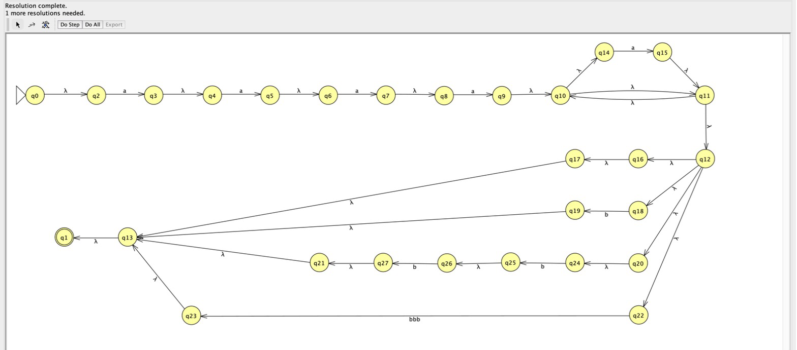

*Рисунок 7 - После шага 5: раскрыта конкатенация `bb`*

**Шаг 6. Конкатенация `bbb`.** Дуга `q22 → q23` разбита на три перехода по `b` через состояния `q28`-`q33`. JFLAP сообщает «The automaton is complete».

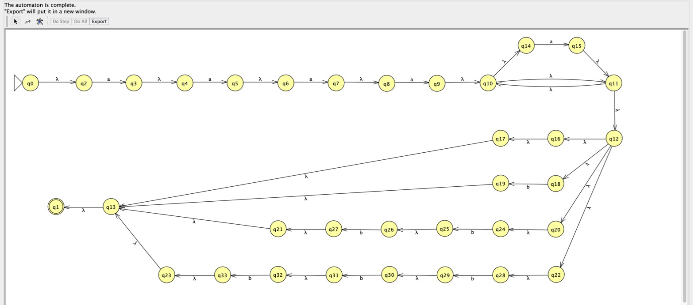

*Рисунок 8 - После шага 6: автомат построен*

### 2.3. Эквивалентный КА

Кнопка **Export** открывает полученный НКА в отдельном окне. В нём 34 состояния и переходы по `a`, `b` и λ.

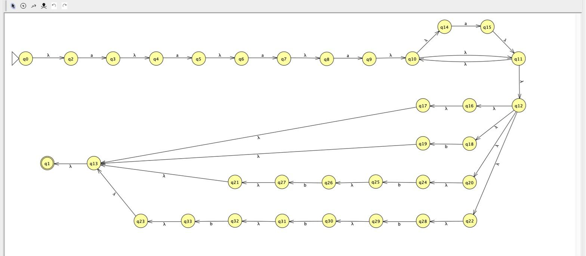

*Рисунок 9 - НКА, эквивалентный регулярному выражению*

### 2.4. Проверка на тестовых цепочках (Input → Multiple Run)

| Цепочка | Ожидание | JFLAP  |
| -------------- | ---------------- | ------ |
| `aaaa`       | Accept           | Accept |
| `aaaaaaabb`  | Accept           | Accept |
| `aaaabbb`    | Accept           | Accept |
| `aaab`       | Reject           | Reject |
| `aaaabbbb`   | Reject           | Reject |
| `aaaaba`     | Reject           | Reject |
| `bbb`        | Reject           | Reject |
| ε             | Reject           | Reject |

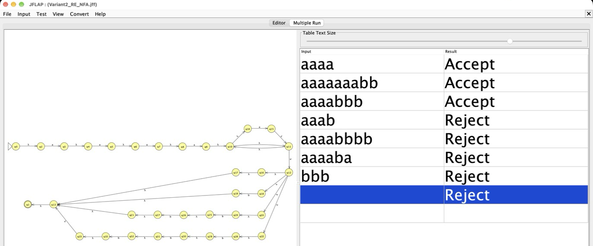

*Рисунок 10 - Проверка НКА, построенного из РВ (пустая строка таблицы - цепочка ε)*

## 3. Часть 2. Регулярная грамматика

### 3.1. Полученная РГ

Праволинейная грамматика `G = ({S, A, B, C, D, E, F}, {a, b}, P, S)`:

```
S → aA
A → aB
B → aC
C → aD
D → aD | bE | λ
E → bF | λ
F → b | λ
```

Нетерминалы `S`, `A`, `B`, `C` порождают четыре обязательных `a`. Нетерминал `D` соответствует состоянию после четырёх `a`: из него можно добавить ещё `a` или начать блок `b`. Нетерминалы `E` и `F` порождают вторую и третью `b`. Правило `D → λ` нужно для цепочек `aⁿ` без `b` при `n ≥ 4`.

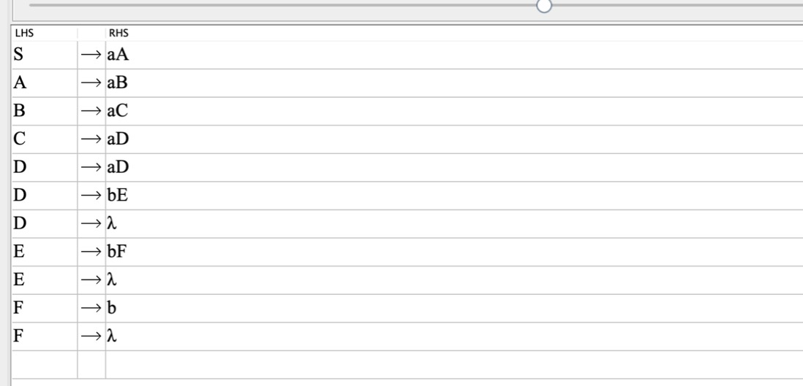

*Рисунок 11 - Регулярная грамматика в JFLAP (файл [Variant2_Grammar.jff](Variant2_Grammar.jff))*

### 3.2. Пошаговое преобразование РГ в КА (Convert → Convert Right-Linear Grammar to FA)

JFLAP создаёт по одному состоянию на каждый нетерминал (`q2 = S`, `q0 = A`, `q1 = B`, `q3 = C`, `q4 = D`, `q5 = E`, `q6 = F`) и одно допускающее состояние `q7`. Затем правило выбирается в таблице и добавляется кнопкой **Create Selected**: правило `X → cY` даёт переход `X → Y` по `c`, правило `X → c` даёт переход `X → q7` по `c`, правило `X → λ` даёт переход `X → q7` по λ.

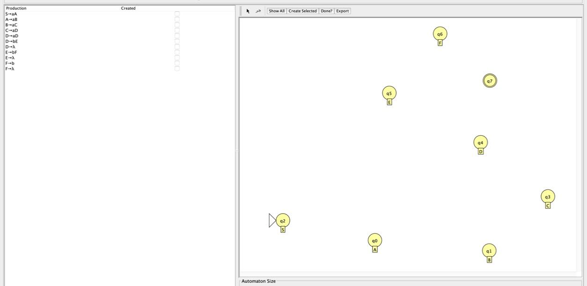

*Рисунок 12 - Состояния для нетерминалов, переходов ещё нет*

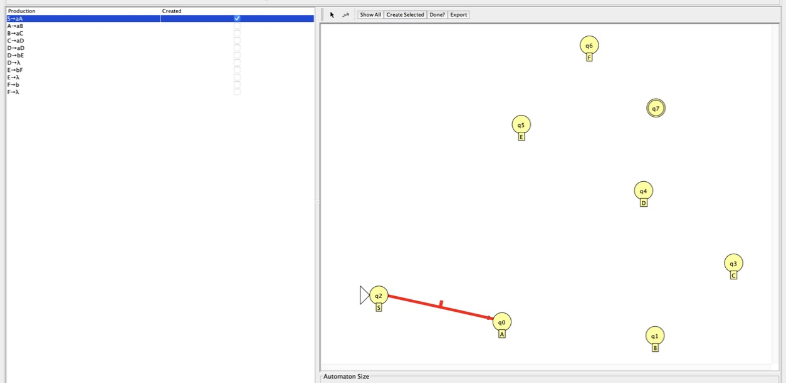

*Рисунок 13 - Правило `S → aA`: переход `S → A` по `a` (выделен красным)*

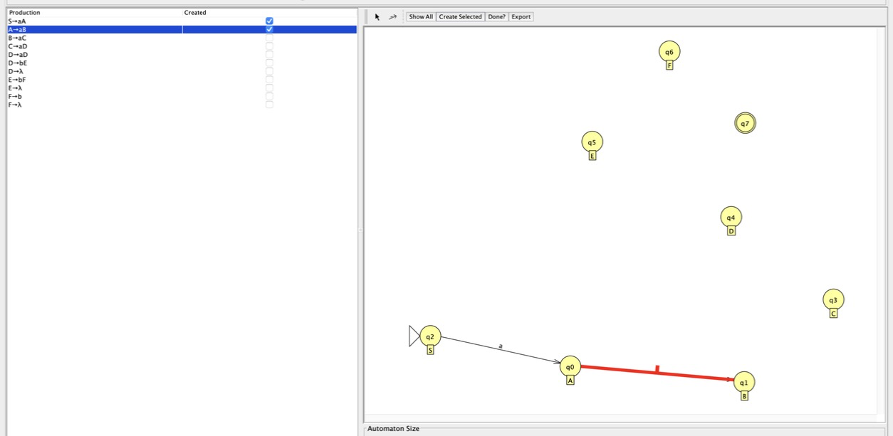

*Рисунок 14 - Правило `A → aB`: переход `A → B` по `a`*

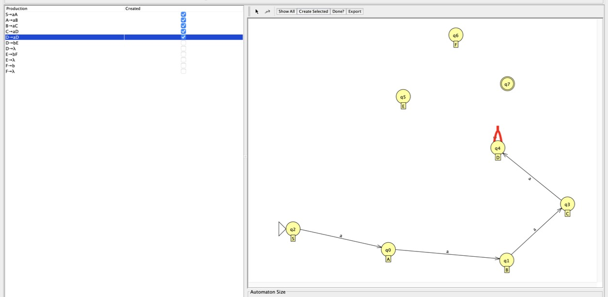

*Рисунок 15 - Добавлены правила до `D → aD` включительно (петля на `D` по `a`)*

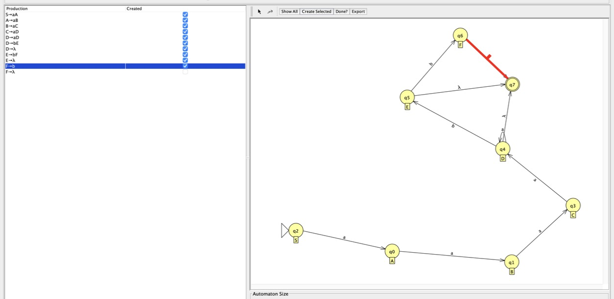

*Рисунок 16 - Добавлены правила до `F → b` включительно; правила `D → λ` и `E → λ` дали λ-переходы в `q7`*

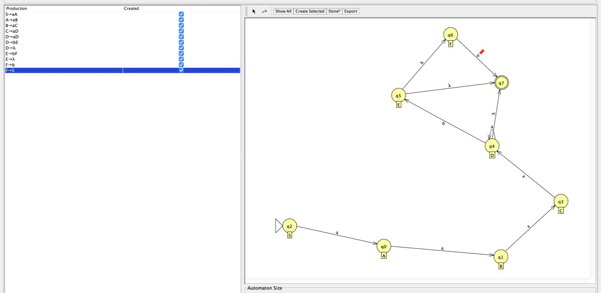

*Рисунок 17 - Добавлено последнее правило `F → λ`, кнопка **Done?** выдаёт «The conversion is finished!»*

После **Export** получен КА:

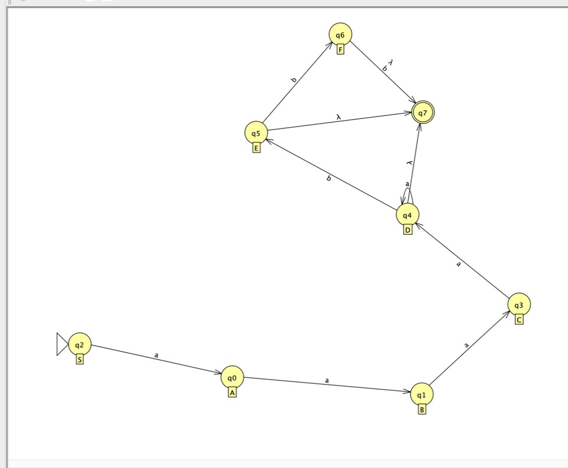

*Рисунок 18 - КА, эквивалентный регулярной грамматике*

Проверка на тех же цепочках (Input → Multiple Run):

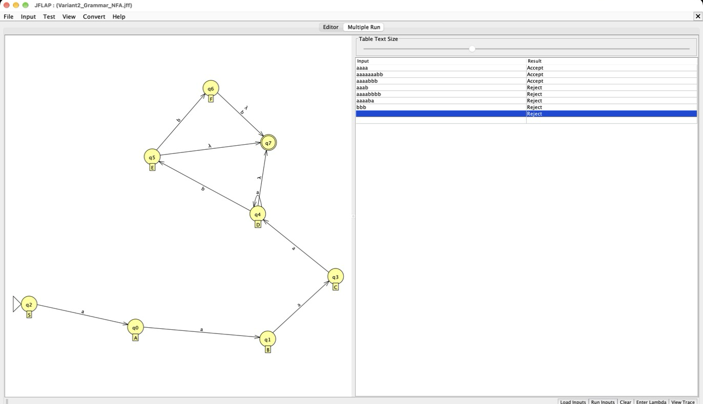

*Рисунок 19 - Проверка КА, построенного из РГ: результаты совпадают с таблицей из п. 2.4*

### 3.3. Пошаговое преобразование КА в РВ (Convert → Convert FA to RE)

JFLAP строит обобщённый граф переходов в три этапа:

1. объединяет параллельные переходы между одной парой состояний в один переход с меткой-объединением;
2. добавляет пустые переходы `∅` между всеми парами состояний, между которыми переходов нет;
3. удаляет по одному все состояния, кроме начального и допускающего. При удалении состояния `k` метка перехода `i → j` заменяется на `r(i,j) + r(i,k) r(k,k)* r(k,j)`.

Перед преобразованием я расставил состояния по эллипсу в порядке `S → A → B → C → D → E → F → q7`. Так исходные переходы идут по контуру, а пустые переходы `∅` проходят внутри. Состояния удалялись вручную инструментом **State Collapser** в порядке `A, B, C, F, E, D`, чтобы были видны промежуточные графы.

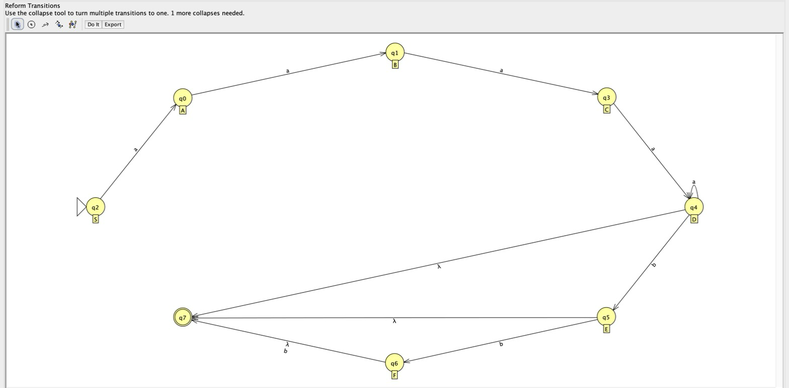

*Рисунок 20 - Исходный граф: между `F` и `q7` два параллельных перехода (`b` и `λ`)*

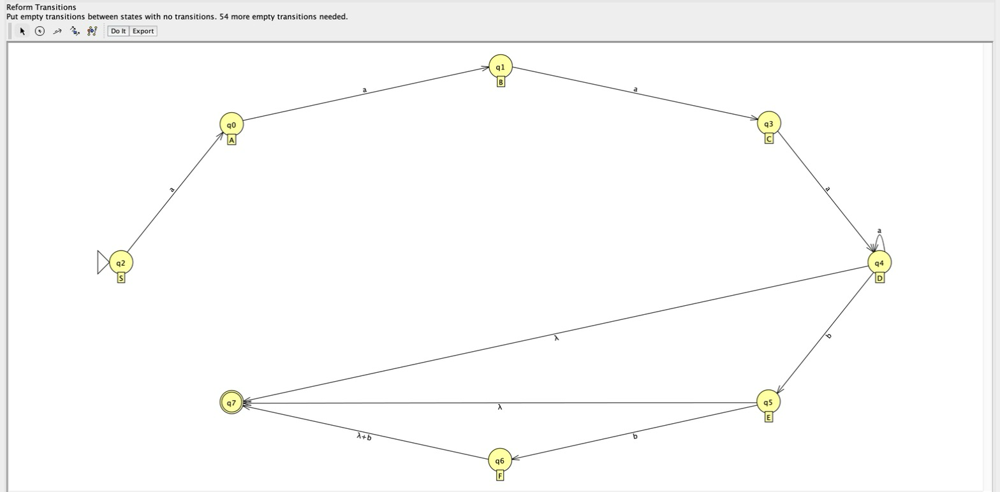

*Рисунок 21 - Параллельные переходы объединены в `λ+b`. Далее нужно добавить 54 пустых перехода*

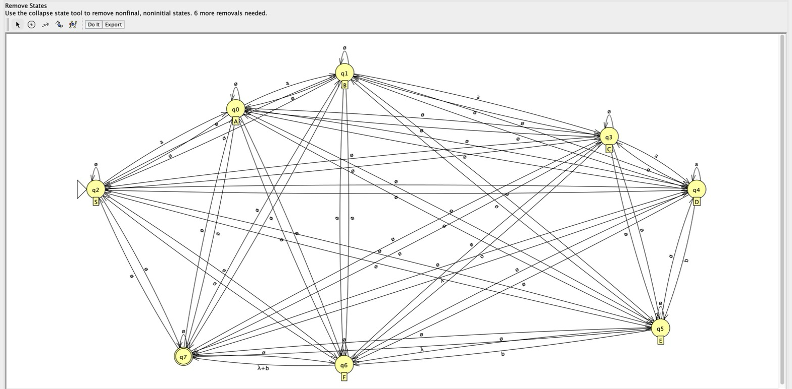

*Рисунок 22 - Добавлены переходы `∅`, граф полный. Осталось удалить 6 промежуточных состояний*

При удалении состояния JFLAP показывает таблицу новых меток (From и To - номера состояний). Если выбрать строку, на графе подсвечиваются переходы, из которых получена метка. Ниже выбрана строка `2 → 1 : aa`: подсвечены прежний переход `S -∅-> B`, переходы `S -a-> A`, `A -a-> B` и петля `A -∅-> A`. По формуле новая метка `S → B` равна `∅ + a·∅*·a = aa`.

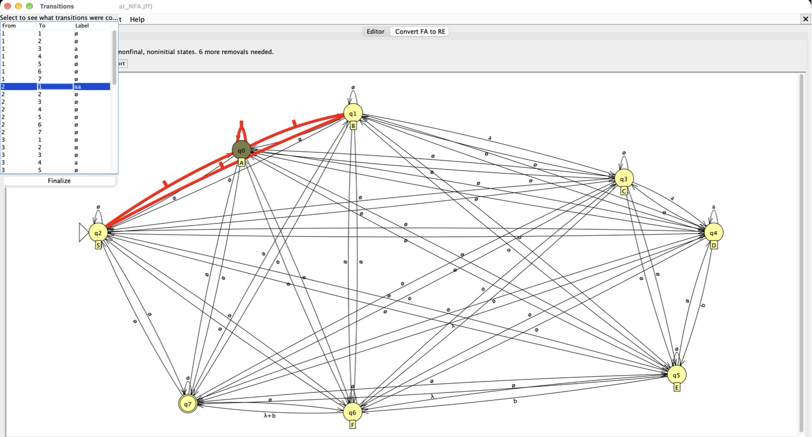

*Рисунок 23 - Удаление состояния `A`: таблица новых меток и подсвеченные исходные переходы*

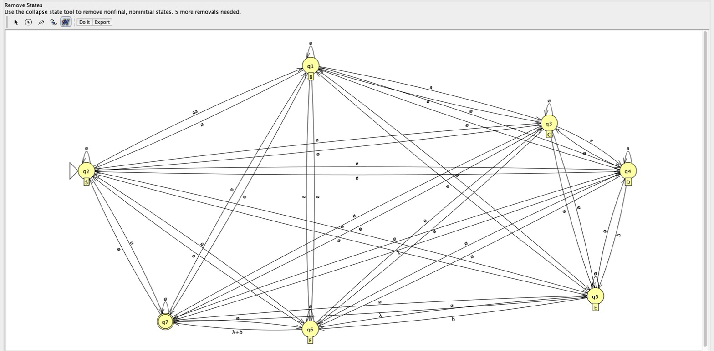

*Рисунок 24 - Состояние `A` удалено: переход `S → B` помечен `aa`*

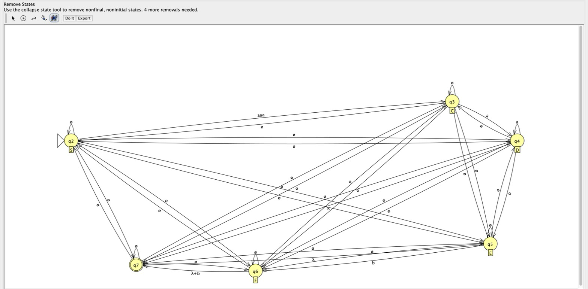

*Рисунок 25 - Состояние `B` удалено: переход `S → C` помечен `aaa`*

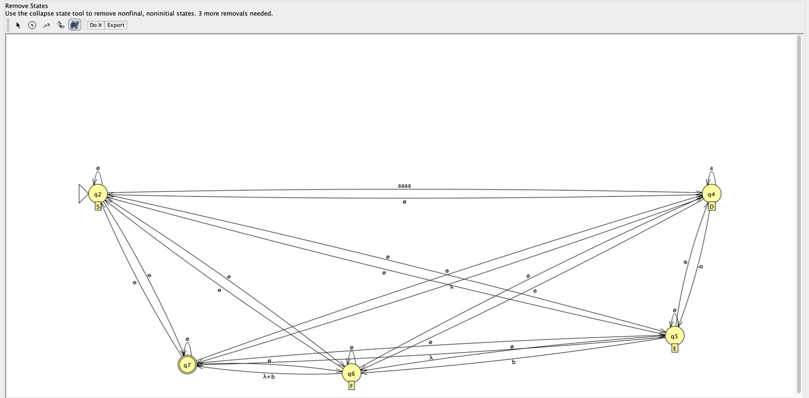

*Рисунок 26 - Состояние `C` удалено: переход `S → D` помечен `aaaa`*

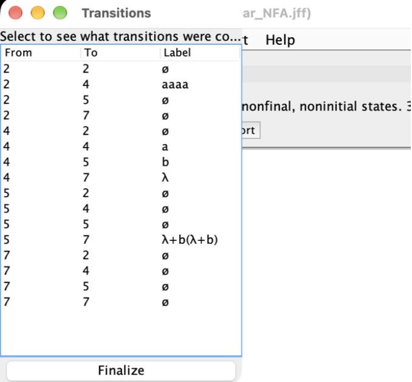

*Рисунок 27 - Таблица при удалении `F`: переход `5 → 7` (`E → q7`) получает метку `λ+b(λ+b)`*

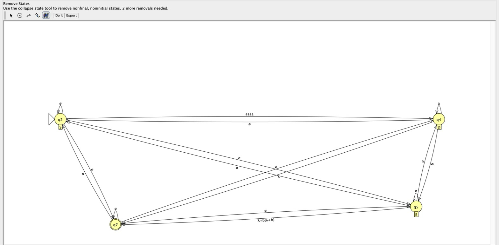

*Рисунок 28 - Состояние `F` удалено*

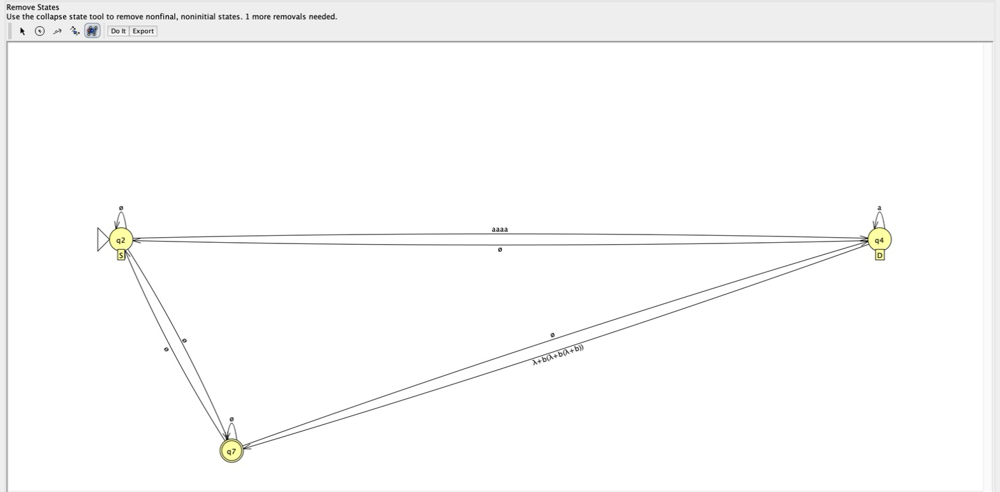

*Рисунок 29 - Состояние `E` удалено: переход `D → q7` помечен `λ+b(λ+b(λ+b))`*

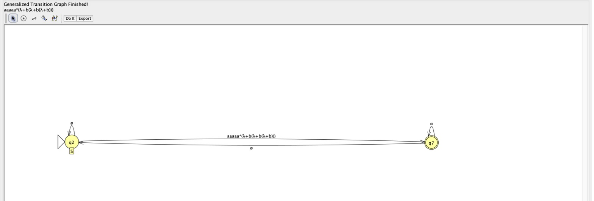

*Рисунок 30 - Состояние `D` удалено, обобщённый граф построен («Generalized Transition Graph Finished!»)*

Полученное РВ:

```
aaaaa*(λ+b(λ+b(λ+b)))
```

Оно эквивалентно выражению из части 1. После раскрытия скобок `b(λ+b(λ+b)) = b + bb + bbb`, поэтому выражение равно `aaaaa*(λ+b+bb+bbb)`. Для дополнительной проверки оба выражения сравнены перебором всех цепочек над `{a, b}` длиной до 13: результаты совпали.

## 4. Часть 3. Нерегулярность языка L28

`L28 = {aⁿbˡaᵏ : n, l, k ≥ 0, k ≠ n + l}`.

**Утверждение.** `L28` не является регулярным языком.

**Доказательство** (от противного, по лемме о разрастании). Пусть `L28` регулярен, и `p ≥ 1` - длина разрастания из леммы.

1. Возьмём цепочку `w = aᵖ b aᵖ⁺¹⁺ᵖ!`, то есть `n = p`, `l = 1`, `k = p + 1 + p!`. Поскольку `k = n + l + p! ≠ n + l`, цепочка `w ∈ L28`, и `|w| ≥ p`.
2. По лемме `w = xyz`, где `|xy| ≤ p`, `|y| ≥ 1` и `xyⁱz ∈ L28` для всех `i ≥ 0`. Так как `|xy| ≤ p`, а первые `p` символов цепочки - это `a`, то `y = aʲ`, где `1 ≤ j ≤ p`.
3. Возьмём `i = 1 + p!/j`. Число `p!/j` целое, потому что `j ≤ p` и `j` делит `p!`. Тогда `xyⁱz = aᵖ⁺ᵖ! b aᵖ⁺¹⁺ᵖ!`, то есть `n' = p + p!`, `l = 1`, `k = p + 1 + p!`.
4. Для этой цепочки `n' + l = p + p! + 1 = k`. Условие `k ≠ n + l` нарушено, значит `xyⁱz ∉ L28`.

Получено противоречие с леммой о разрастании, следовательно, `L28` не регулярен. ∎

Тот же приём можно увидеть на тренажёре **Regular Pumping Lemma** в JFLAP. Языка `L28` в его списке нет, поэтому взят близкий по устройству язык `{aⁿbᵏcⁿ⁺ᵏ}`. Компьютер выбирает `m = 6` и разбиение `x = λ`, `y = a⁶`, `z = c⁶` для цепочки `w = a⁶c⁶`. При `i = 2` получается `a¹²c⁶`, которая языку не принадлежит («YOU WIN»). Как и в доказательстве выше, накачка символов `a` нарушает соотношение длин.

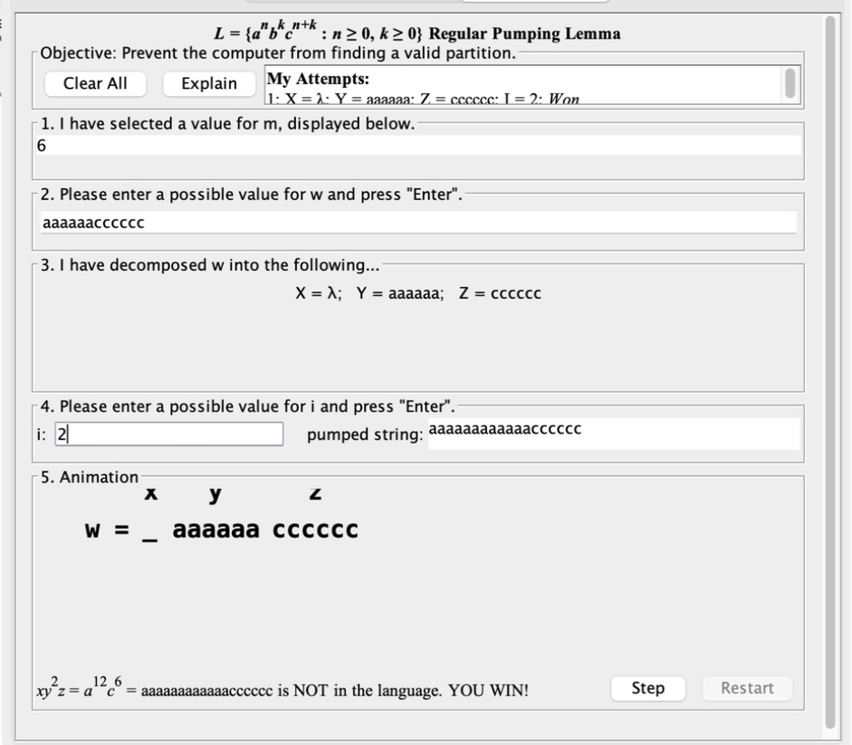

*Рисунок 31 - Тренажёр Regular Pumping Lemma в JFLAP*

## 5. Вывод

Язык `L2 = {aⁿbᵐ : n ≥ 4, m ≤ 3}` регулярен: для него построены регулярное выражение `aaaaa*(!+b+bb+bbb)` и праволинейная грамматика. В JFLAP пошагово выполнены преобразования РВ → КА, РГ → КА и КА → РВ. Автоматы, полученные из РВ и из РГ, на всех тестовых цепочках дают одинаковые результаты. Обратное преобразование дало выражение `aaaaa*(λ+b(λ+b(λ+b)))`, эквивалентное исходному. Для языка `L28 = {aⁿbˡaᵏ : k ≠ n + l}` по лемме о разрастании доказана нерегулярность.
